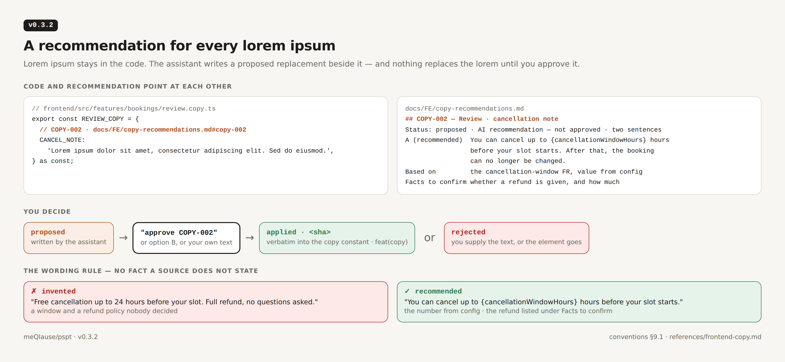
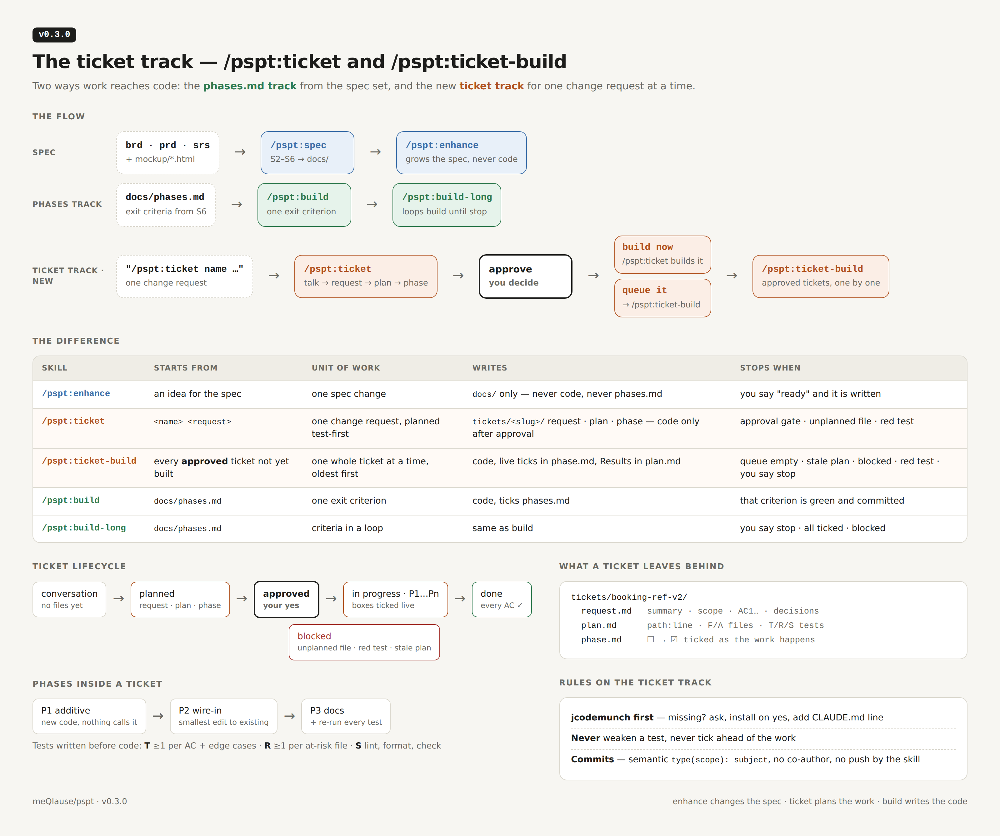
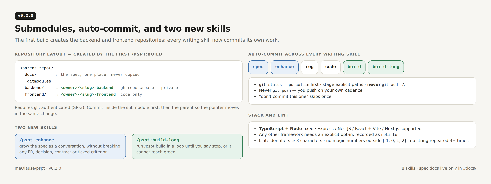
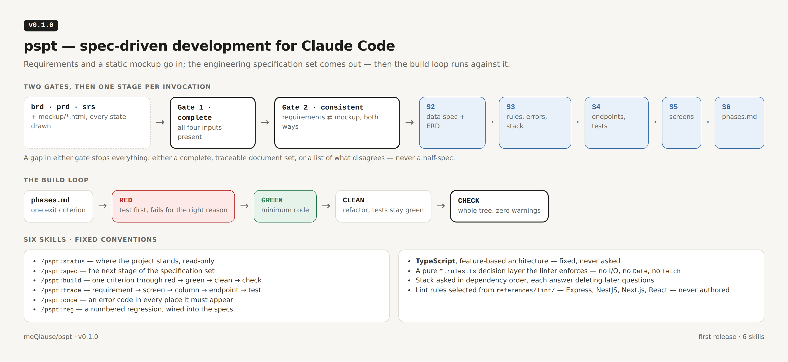

# Changelog

Every release of `pspt`, newest first. Each version is a git tag (`vX.Y.Z`) on
its `chore(release)` commit; the tag message is the short form of the section
below. Pictures are rendered from [`releases/src/`](releases/src/).

| Version | Date | Headline |
|---|---|---|
| [0.3.2](#v032--2026-09-29) | 2026-09-29 | A recommendation for every lorem ipsum |
| [0.3.1](#v031--2026-09-29) | 2026-09-29 | Never invent frontend copy |
| [0.3.0](#v030--2026-09-28) | 2026-09-28 | The ticket track — `/pspt:ticket` and `/pspt:ticket-build` |
| [0.2.0](#v020--2026-09-24) | 2026-09-24 | Submodules, auto-commit, `/pspt:enhance`, `/pspt:build-long` |
| [0.1.0](#v010--2026-09-23) | 2026-09-23 | First release — spec-driven development for Claude Code |

---

## v0.3.2 — 2026-09-29

**A recommendation for every lorem ipsum.** Lorem ipsum stays in the code; the
assistant writes a proposed replacement beside it, and nothing replaces the
lorem until you approve it.

**Added**

- **Copy recommendations** ([`conventions.md` §9.1](references/conventions.md)) —
  every placeholder gets a `COPY-nnn` section in
  `docs/FE/copy-recommendations.md`, referenced from the copy constant by a
  comment, so each points at the other. Each section is marked *AI
  recommendation — not approved* and carries 1–3 options, what it is based on,
  and the facts to confirm.
- **The wording rule** — a recommendation states no fact a source does not
  state: no invented number, discount, policy, guarantee or claim. Values come
  from configuration as named slots (`{cancellationWindowHours}`).
- **Approval flow** — `proposed` → you say "approve COPY-002" → `applied`
  verbatim and committed as `feat(copy)`; or `rejected`.
- [`references/frontend-copy.md`](references/frontend-copy.md) — the
  recommendation for AI assistants, shown on one booking screen built twice,
  every section referencing its part of the image.

**Changed**

- S5, `/pspt:build`, `/pspt:ticket` and `/pspt:ticket-build` follow §9.1. The
  ticket's `plan.md` §5a links each `COPY-nnn`; its close-out report lists
  recommendations waiting for you.

## v0.3.1 — 2026-09-29

**Never invent frontend copy.** If the text is already defined, write it; if
not, write lorem ipsum. Never text the assistant made up.

**Added**

- **Conventions §9, frontend copy** — text defined in the mockup, the spec, the
  PRD/SRS, an existing copy constant or by you is written verbatim, without
  asking again. Text nothing defines is lorem ipsum sized to its expected
  length — never `TBD`, never a guessed sentence.
- Placeholders live in the feature's copy constant (one `grep` finds them all)
  and are recorded as rows. Tests find elements by role or test id, never by
  placeholder text.
- Data is not copy: prices, names and dates stay realistic, never lorem.

**Changed**

- S5 gains the rule and an exit criterion; `/pspt:build` applies it;
  `/pspt:ticket` asks only for undefined text and records placeholders in
  `plan.md` §5a.

## v0.3.0 — 2026-09-28

**The ticket track.** Talk one change through against the real code, plan it
test-first, approve it, then build it — now, or queued.

**Added**

- **`/pspt:ticket <name> <request>`** — a conversation like `/pspt:enhance`
  that reads the code every turn, so each question is settled by you or by the
  code before anything is written. On "ready" it writes `tickets/<slug>/`:
  - `request.md` — summary, why, scope, checkable acceptance criteria, decisions
  - `plan.md` — current state with `path:line`, affected and at-risk files,
    T / R / S tests written before code, traceability check
  - `phase.md` — additive → wire-in → docs; every task, test and done-when a
    checkbox ticked live as the work happens

  It stops for approval, then builds phase by phase, stopping on any unplanned
  file or red test. It never overwrites an existing ticket.
- **`/pspt:ticket-build`** — builds every approved ticket not yet built, one at
  a time, in-progress first then oldest; re-checks each plan against the
  current code; stops on a stale plan, a blocked ticket or a red test.
- **jcodemunch prerequisite** — both ticket skills read code through the
  jcodemunch MCP server; if missing they ask before installing it and add its
  line to the project's `CLAUDE.md`.

**Changed**

- `/pspt:enhance` and the README describe ticket as it exists, no longer as a
  planned skill.

## v0.2.0 — 2026-09-24

**Submodules, auto-commit, and two new skills.** The first build creates the
backend and frontend repositories; every writing skill commits its own work.

**Added**

- **`/pspt:build-long`** — runs `/pspt:build` in a loop until you say stop.
- **`/pspt:enhance`** — grows the spec as a conversation without breaking any
  existing FR, NFR, decision, error code or ticked criterion.
- **Submodules** — the first `/pspt:build` creates `<slug>-backend` and
  `<slug>-frontend` with `gh repo create --private` and wires them as
  `backend/` and `frontend/`. Requires `gh`, authenticated (SR-3).
- **Lint** — identifiers at least 3 characters; no magic numbers outside
  `[-1, 0, 1, 2]`; no string literal repeated 3+ times in a file.

**Changed**

- **Auto-commit everywhere** — spec, enhance, reg, code, build and build-long
  commit their own work: `git status --porcelain` first, explicit paths, never
  `git add -A`, never `git push`.
- **Stack** — TypeScript on Node fixed; Express, NestJS, React + Vite and
  Next.js supported; anything else needs an explicit opt-in, recorded as
  `noLinter`.
- **Docs live only in `./docs/`** — submodules hold code only; the `repos`
  field in `.pspt.json` is gone.

## v0.1.0 — 2026-09-23

**First release — spec-driven development for Claude Code.** Requirements and a
static mockup go in; the engineering specification set comes out, then the
build loop runs against it.

**Added**

- **Six skills** — `/pspt:status`, `/pspt:spec`, `/pspt:build`, `/pspt:trace`,
  `/pspt:code`, `/pspt:reg`.
- **Two gates** before anything is written: all four inputs present, and
  requirements and mockup consistent in both directions.
- **Stages S2–S6** — data spec and ERD, decisions, backend contracts and
  testing, frontend screens, phased plan — one per invocation, with a
  checkpoint between each.
- **The build loop** — red → green → clean → check, one exit criterion at a
  time, zero warnings.
- **Fixed conventions** — TypeScript, feature-based architecture, a pure
  `*.rules.ts` decision layer the linter enforces; lint rules selected from
  `references/lint/` for Express, NestJS, Next.js and React.
