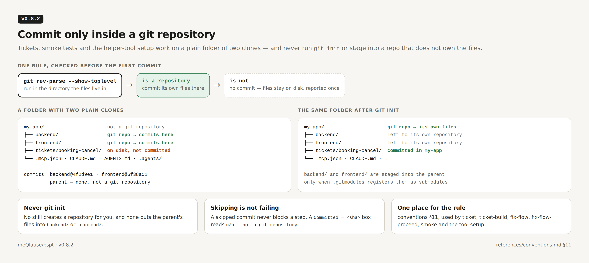
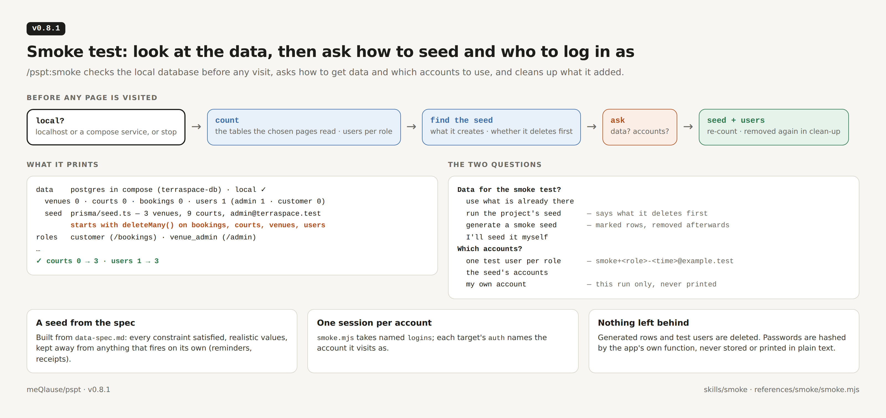
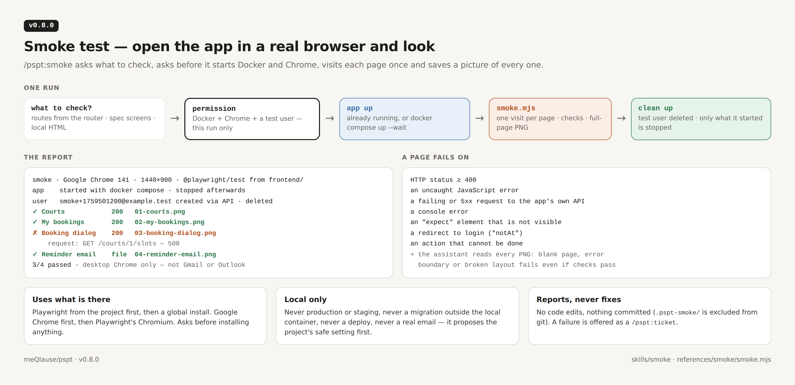
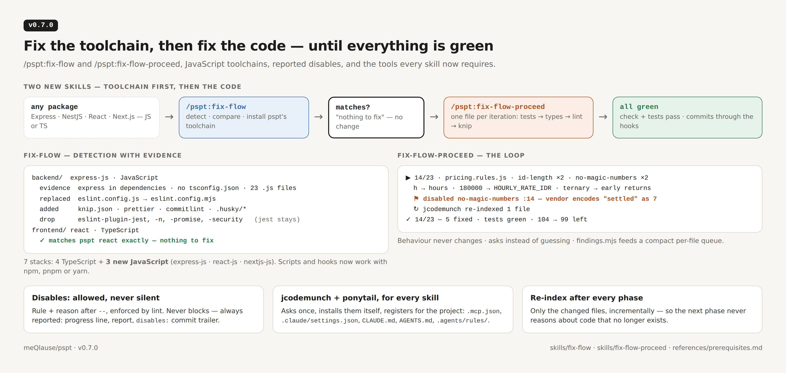
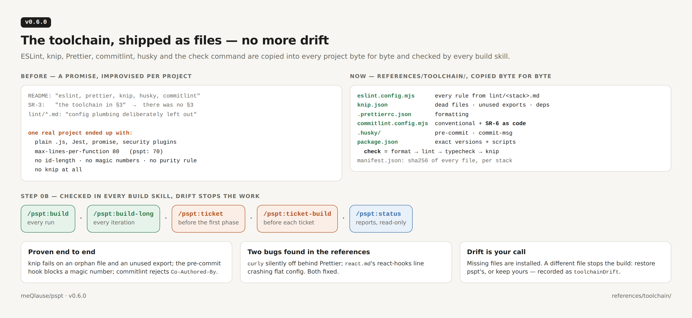
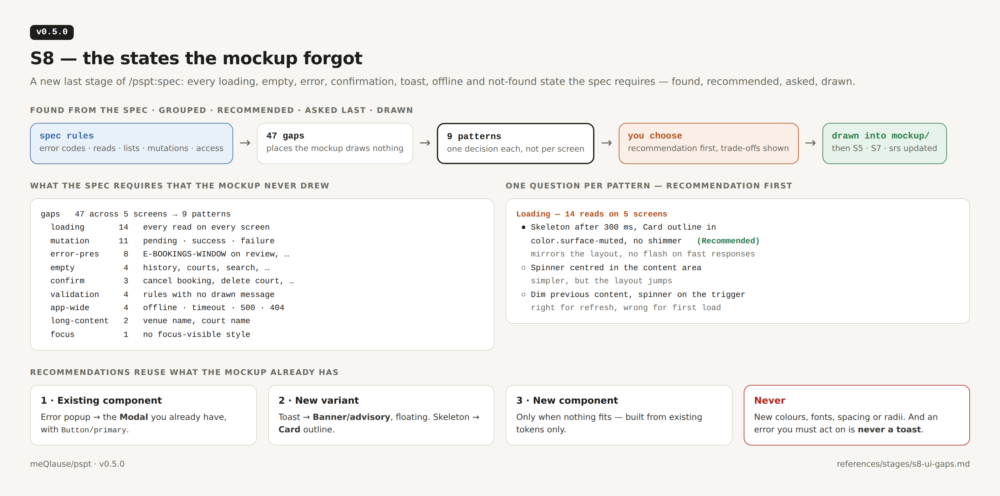
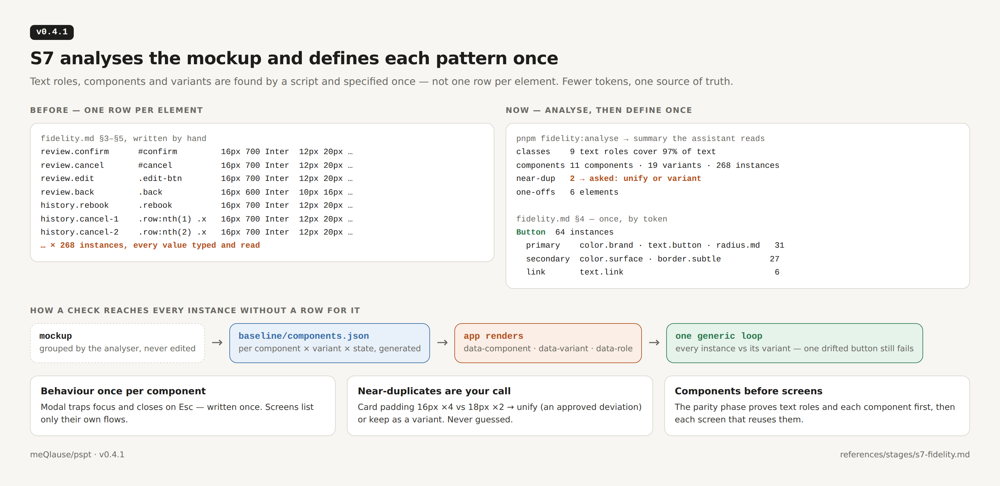
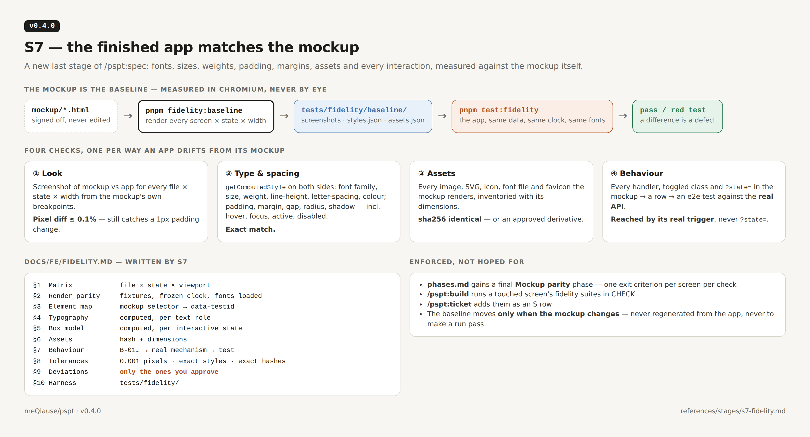

# Changelog

Every release of `pspt`, newest first. Each version is a git tag and a
[GitHub Release](https://github.com/meQlause/pspt/releases) whose text is the
matching file in [`releases/notes/`](releases/notes/) — the section below with
absolute image links. Versions are listed in
[`releases/releases.txt`](releases/releases.txt); pictures are rendered from
[`releases/src/`](releases/src/).

| Version | Date | Headline |
|---|---|---|
| [0.8.2](#v082--2026-10-05) | 2026-10-05 | Commit only inside a git repository |
| [0.8.1](#v081--2026-10-03) | 2026-10-03 | Smoke test: look at the data, then ask how to seed and who to log in as |
| [0.8.0](#v080--2026-10-03) | 2026-10-03 | Smoke test — open the app in a real browser and look |
| [0.7.0](#v070--2026-10-02) | 2026-10-02 | Fix the toolchain, then fix the code — until everything is green |
| [0.6.0](#v060--2026-10-02) | 2026-10-02 | The toolchain, shipped as files — no more drift |
| [0.5.0](#v050--2026-10-02) | 2026-10-02 | S8 — the states the mockup forgot |
| [0.4.1](#v041--2026-10-02) | 2026-10-02 | S7 analyses the mockup and defines each pattern once |
| [0.4.0](#v040--2026-10-02) | 2026-10-02 | S7 — the finished app matches the mockup |
| [0.3.2](#v032--2026-09-29) | 2026-09-29 | A recommendation for every lorem ipsum |
| [0.3.1](#v031--2026-09-29) | 2026-09-29 | Never invent frontend copy |
| [0.3.0](#v030--2026-09-28) | 2026-09-28 | The ticket track — `/pspt:ticket` and `/pspt:ticket-build` |
| [0.2.0](#v020--2026-09-24) | 2026-09-24 | Submodules, auto-commit, `/pspt:enhance`, `/pspt:build-long` |
| [0.1.0](#v010--2026-09-23) | 2026-09-23 | First release — spec-driven development for Claude Code |

---

## v0.8.2 — 2026-10-05

**Commit only inside a git repository.** Tickets, smoke tests and the
helper-tool setup now work on a plain folder that holds two clones — the folder
the tutorial recommends for an existing project — instead of failing at the
first commit.

**Fixed**

- On a folder that is not a git repository (`my-app/` holding `backend/` and
  `frontend/` clones), `/pspt:ticket` could not commit the helper-tool files
  (`.mcp.json`, `.claude/`, `CLAUDE.md`, `AGENTS.md`, `.agents/`), and none of
  its parent commits — the plan, the approval, each phase, the close-out — had
  anywhere to go. Found by running the real skills on such a folder.

**Changed**

- **One rule, [conventions §11](references/conventions.md):**
  a commit is made in each git repository the work touched, and nowhere else.
  A package that is a repository gets its own commit. A parent that is not a
  repository gets **none** — `tickets/`, `docs/`, the tooling files and
  `.pspt-smoke/` stay on disk, and the report says so once. No skill runs
  `git init`.
- A parent that **is** a repository commits only its own files. `backend/` and
  `frontend/` are staged into it only when `.gitmodules` registers them as
  submodules; two plain clones are left to their own repositories.
- A `Committed — <sha>` box in a ticket reads `n/a — not a git repository` when
  no repository owns that phase's files. A skipped commit never blocks a step.
- Applies to `/pspt:ticket`, `/pspt:ticket-build`, `/pspt:fix-flow`,
  `/pspt:fix-flow-proceed`, `/pspt:smoke` and the tool setup
  (`references/prerequisites.md` §3.5). `/pspt:smoke` adds `.pspt-smoke/` to
  `.git/info/exclude` only where there is a repository to exclude it from.

---

## v0.8.1 — 2026-10-03

**Smoke test: look at the data, then ask how to seed and who to log in as.**
`/pspt:smoke` now checks the local database before it visits any page.

**Added**

- **Data and accounts step** — before any visit, `/pspt:smoke` confirms the
  database is local (otherwise it stops), counts the rows in the tables the
  chosen pages read and the users per role, finds the project's own seed and
  reads whether it deletes data first, and works out which roles the pages
  need. Then it asks two questions:
  - **Data:** use what is already there · run the project's seed (saying what
    it deletes first) · generate a smoke seed — the fewest rows the pages need,
    built from `data-spec.md`, every row marked and removed again in clean-up
    · or "I'll seed it myself".
  - **Accounts:** one throwaway test user per role · the seed's accounts · or
    the user's own account, for this run only and never printed.
- **Named logins in `smoke.mjs`** — `"logins": { "customer": …, "admin": … }`
  opens one browser session per account; each target's `auth` names the
  account it visits as.

**Changed**

- Clean-up also removes generated seed rows (children first, by recorded id)
  and deletes a run plan that holds a password the user typed. Rows from the
  project's own seed stay, and the report says so.
- A role the API cannot grant is created through the app's own user service,
  or inserted with a password hashed by the app's own function — never plain
  text.

---

## v0.8.0 — 2026-10-03

**Smoke test — open the app in a real browser and look.** One new skill answers
"does the app run": it asks what to check, asks before it starts Docker and
Chrome, visits each page once and saves a picture of every one.

**Added**

- **`/pspt:smoke`** — offers the pages to check from the frontend router, the
  spec's screens and local HTML files (email previews), then asks once for
  permission to run Docker and Chrome for this run. It uses the app if it is
  already running, otherwise `docker compose up -d --wait`; logs in with a
  throwaway `smoke+<time>@example.test` user when a page needs it; visits each
  page once; and saves a full-page PNG of each. A page fails on an HTTP error,
  an uncaught JavaScript error, a failing or `5xx` request to the app's API, a
  console error, a missing element or a login redirect — and the assistant
  reads every picture, so a blank page or a broken layout fails too. The test
  user is always deleted, and only what the skill started is stopped.
- **`references/smoke/smoke.mjs`** — the runner: Playwright from the project
  first, then a global install; Google Chrome first, then Playwright's
  Chromium. Writes the PNGs and `report.json` to `.pspt-smoke/<run>/`, which is
  excluded from git. Exit `0` pass, `1` fail, `2` no browser.

**Limits, stated in every report**

- Local only: never production or staging, never a migration outside the local
  container, never a deploy, never a real email or payment.
- Desktop Chrome only — not how Gmail or Outlook render an email, no
  email-client dark mode, no WebP handling of mail clients.
- One visit per page — a smoke test, not a test suite. Failures are offered as
  a `/pspt:ticket`; the skill never edits code.

---

## v0.7.0 — 2026-10-02

**Fix the toolchain, then fix the code — until everything is green.** Two new
skills repair an existing project, JavaScript projects get their own
toolchains, disables become reported instead of banned, and every skill now
brings the tools it needs.

**Added**

- **`/pspt:fix-flow`** — finds each package, detects its stack (Express,
  NestJS, React, Next.js) and language from its dependencies and sources, and
  compares its toolchain with pspt's. A match prints **"nothing to fix"**;
  otherwise it installs pspt's files, removes second configs, pins versions and
  scripts, drops only unused lint/format/hook packages, installs, autofixes and
  reports what is left. Unsupported stacks are refused with the reason. Its
  mechanics are `references/toolchain/fix-flow.mjs`.
- **`/pspt:fix-flow-proceed`** — loops over the code until `check` and the test
  suite pass: failing tests first (the safety net), then types, lint and knip,
  one file per iteration, behaviour unchanged, asking instead of guessing.
  Commits land through the hooks once the tree is green. Its work queue is
  `references/toolchain/findings.mjs`.
- **JavaScript toolchains** — `express-js`, `react-js`, `nextjs-js`: the same
  rules minus the TypeScript-only ones, Node or browser globals, Jest/Vitest
  globals for tests. All seven stacks pass `verify/`.
- **Required tools for every skill** ([`prerequisites.md`](references/prerequisites.md))
  — [jCodeMunch](https://pypi.org/project/jcodemunch-mcp/) and
  [Ponytail](https://ponytail.dev/). Missing → one question, then the skill
  installs them itself and registers them for the project: `.mcp.json`,
  `.claude/settings.json`, `CLAUDE.md`, `AGENTS.md`, `.agents/rules/`.
  pspt's spec, conventions, lint rules and tests always win over Ponytail.
- **Re-index after every phase** — jcodemunch re-indexes only the files each
  phase, criterion, iteration or ticket changed.

**Changed**

- **Disable directives** — allowed, never silent (conventions §10): the rule
  named and a reason after `--`, enforced in every config; blanket, unpaired
  and unused disables are errors; `@ts-expect-error` only with a description.
  They never block a skill and are always reported — progress line, report,
  `disables:` commit trailer, and `findings.mjs`.
- Toolchain scripts and hooks work with npm, pnpm or yarn.

**Fixed**

- Shipped toolchain files were not Prettier-formatted, so the first
  `prettier --write` made every project read as drifted.
- JavaScript configs linted pspt's own `eslint.config.mjs`, which failed its
  own rules; all configs now ignore pspt's toolchain files.

## v0.6.0 — 2026-10-02

**The toolchain, shipped as files — no more drift.** ESLint, knip, Prettier,
commitlint, husky and the `check` command are copied into every project byte
for byte and checked by every build skill.

**Why.** The lint references were prose and rule snippets, and the rest of the
promised toolchain had no definition at all — SR-3 pointed at a "§3" that did
not exist. Projects improvised: one ended up in plain JavaScript with
different plugins and limits, no `id-length`, no magic-value rules, no purity
boundary, and no knip.

**Added**

- **[`references/toolchain/`](references/toolchain/README.md)**, per stack
  (Express, NestJS, React, Next.js):
  - `eslint.config.mjs` — every rule, threshold, severity and exemption from
    `references/lint/<stack>.md`, nothing added
  - `knip.json` — dead files, unused exports, unused dependencies
  - `package.toolchain.json` — exact versions, and `check` = format → lint →
    typecheck → knip
- **Shared** — `.prettierrc.json`, `.prettierignore`, `commitlint.config.mjs`
  with **SR-6 as a rule** (no `Co-Authored-By`, session link or "generated
  with"), husky `pre-commit` (`pnpm check`) and `commit-msg` (commitlint).
- **`manifest.json`** — every file's project path, source and sha256, per stack.
- **`verify/`** — fixtures and expected rule sets proving each ESLint config.
  The chain was also run end to end on an Express project: knip failing the
  check on an orphan file and an unused export, the pre-commit hook blocking a
  magic number, commitlint rejecting `Co-Authored-By`.

**Changed**

- **`/pspt:build` Step 0b** installs the toolchain when missing and, on every
  invocation, checks every file's hash, second configs, exact versions,
  scripts, active hooks, TypeScript strict and Playwright Chromium. Drift
  stops the work: restore pspt's toolchain, or keep yours (recorded as
  `toolchainDrift`).
- It runs in **`/pspt:build`**, **`/pspt:build-long`**, before
  **`/pspt:ticket`**'s first phase and before each **`/pspt:ticket-build`**
  ticket; **`/pspt:status`** reports it.
- SR-3, S3, the lint references and the README point at the toolchain.

**Fixed**

- `curly: 'all'` never fired: `eslint-config-prettier` turns it off. Every
  config re-enables it after Prettier.
- `react.md` named the legacy react-hooks config, which crashes flat config;
  it is now `reactHooks.configs.flat['recommended-latest']`.

## v0.5.0 — 2026-10-02

**S8 — the states the mockup forgot.** A new last stage of `/pspt:spec` finds
every loading, empty, error, confirmation, toast, offline and not-found state
the spec requires but the mockup never drew, recommends how to fill it, asks
you, and draws your answer into the mockup.

**Added**

- **Stage S8, UI gap analysis** ([`s7-ui-gaps.md`](https://github.com/meQlause/pspt/blob/6e77eef42c1bafcdb10f49d9c21854fc7eba1791/references/stages/s8-ui-gaps.md))
  — writes `docs/FE/ui-gaps.md`.
- **Found from the spec, not guessed** — every error code's presentation on the
  screens that receive it; loading, refresh and failure for every read; empty
  and end states for every list; pending, success and failure for every
  mutation; confirmation or undo for destructive actions; a message per form
  rule; `409` conflict; `401` / `403` / `404`; offline, timeout, `500`, unknown
  route; long and missing values; undrawn breakpoints; focus and disabled.
- **Grouped into patterns** — fourteen missing loading states are one decision,
  not fourteen questions.
- **Recommended from what exists** — an existing component first, then a new
  variant, then a new component from existing tokens; never new colours, fonts
  or spacing. Errors you must act on are never toasts; skeletons mirror the
  layout; loading waits 300 ms; motion honours reduced-motion.
- **Asked last** — one `AskUserQuestion` per pattern, recommendation first with
  its trade-offs; skipped patterns name the fallback the app shows.
- **Drawn into the mockup** — approved states become mockup states using
  existing classes and tokens, then fold into the S5 refactor map and screen
  documents, additive FRs in `srs.md`, the S7 matrix and baseline, and
  `COPY-nnn` copy recommendations.

**Changed**

- `/pspt:spec`, `/pspt:status`, S7 and the README list the new stage.

## v0.4.1 — 2026-10-02

**S7 analyses the mockup and defines each pattern once.** Text roles, components
and variants are found by a script and specified once — not one row per
element. Fewer tokens, one source of truth.

**Changed**

- **Analyse first** — `pnpm fidelity:analyse` renders the mockup and groups
  elements into text roles (by computed type signature), components (repeated
  structures) and variants, and reports counts, near-duplicates, one-offs and
  untokenised values. The assistant reads that summary, never the raw markup.
- **Define once** — each text role and each component variant × state is
  written once by token name; every instance inherits it. Measured values live
  only in generated `baseline/*.json`, never typed into `fidelity.md`.
- **One mapping convention** — the app renders `data-component`,
  `data-variant` and `data-role`; generic style specs loop over them, so a
  drifted instance still fails without a row of its own, and a new screen adds
  a fixture, not test code.
- **Behaviour once per component** — screens list only their own flows.
- **Near-duplicates are your call** — unify (an approved deviation) or keep as
  a variant; never guessed.
- **Components before screens** in the Mockup parity phase.
- `/pspt:build` renders the attributes and runs touched components' suites;
  S5 names its UI kit the way S7 and the app will.

## v0.4.0 — 2026-10-02

**S7 — the finished app matches the mockup.** A new last stage of
`/pspt:spec` measures the app against the mockup itself: fonts, sizes, weights,
padding, margins, assets and every interaction.

**Added**

- **Stage S7, mockup fidelity** ([`s6-fidelity.md`](https://github.com/meQlause/pspt/blob/6e77eef42c1bafcdb10f49d9c21854fc7eba1791/references/stages/s7-fidelity.md))
  — writes `docs/FE/fidelity.md`. Every value is read from the mockup rendered
  in Chromium, never from its CSS by eye and never from the app:
  - **Look** — every mockup file × state × viewport (from the mockup's own
    breakpoints), screenshot-compared; pixel diff ≤ 0.001 by default
  - **Type and spacing** — font family, size, weight, line-height,
    letter-spacing, colour, padding, margin, gap, radius and shadow via
    `getComputedStyle`, per interactive state; exact match
  - **Assets** — every image, SVG, icon, font file and favicon by sha256
  - **Behaviour** — every handler, toggled class and `?state=` in the mockup
    mapped to its real mechanism and an e2e test against the real API
- **Render parity** — same data through fixtures, frozen clock, fonts loaded,
  motion off for capture, so a difference is always a defect.
- **Deviations** — only the ones you approve, each listed with its reason.
- **`tests/fidelity/`** — the fifth test suite; the baseline is generated from
  the mockup and moves only when the mockup changes.

**Changed**

- S7 appends a **Mockup parity** phase and a Fidelity definition-of-done row to
  `phases.md`.
- `/pspt:build` runs a touched screen's fidelity suites in CHECK;
  `/pspt:ticket` adds them as an S row.
- `/pspt:spec`, `/pspt:status`, conventions §8, S5 and the README list the
  new stage; `/pspt:status` reports build progress on its own row.

## v0.3.2 — 2026-09-29

**A recommendation for every lorem ipsum.** Lorem ipsum stays in the code; the
assistant writes a proposed replacement beside it, and nothing replaces the
lorem until you approve it.

**Added**

- **Copy recommendations** ([`conventions.md` §9.1](references/conventions.md)) —
  every placeholder gets a `COPY-nnn` section in
  `docs/FE/copy-recommendations.md`, referenced from the copy constant by a
  comment, so each points at the other. Each section is marked *AI
  recommendation — not approved* and carries 1–3 options, what it is based on,
  and the facts to confirm.
- **The wording rule** — a recommendation states no fact a source does not
  state: no invented number, discount, policy, guarantee or claim. Values come
  from configuration as named slots (`{cancellationWindowHours}`).
- **Approval flow** — `proposed` → you say "approve COPY-002" → `applied`
  verbatim and committed as `feat(copy)`; or `rejected`.
- [`references/frontend-copy.md`](references/frontend-copy.md) — the
  recommendation for AI assistants, shown on one booking screen built twice,
  every section referencing its part of the image.

**Changed**

- S5, `/pspt:build`, `/pspt:ticket` and `/pspt:ticket-build` follow §9.1. The
  ticket's `plan.md` §5a links each `COPY-nnn`; its close-out report lists
  recommendations waiting for you.

## v0.3.1 — 2026-09-29

**Never invent frontend copy.** If the text is already defined, write it; if
not, write lorem ipsum. Never text the assistant made up.

**Added**

- **Conventions §9, frontend copy** — text defined in the mockup, the spec, the
  PRD/SRS, an existing copy constant or by you is written verbatim, without
  asking again. Text nothing defines is lorem ipsum sized to its expected
  length — never `TBD`, never a guessed sentence.
- Placeholders live in the feature's copy constant (one `grep` finds them all)
  and are recorded as rows. Tests find elements by role or test id, never by
  placeholder text.
- Data is not copy: prices, names and dates stay realistic, never lorem.

**Changed**

- S5 gains the rule and an exit criterion; `/pspt:build` applies it;
  `/pspt:ticket` asks only for undefined text and records placeholders in
  `plan.md` §5a.

## v0.3.0 — 2026-09-28

**The ticket track.** Talk one change through against the real code, plan it
test-first, approve it, then build it — now, or queued.

**Added**

- **`/pspt:ticket <name> <request>`** — a conversation like `/pspt:enhance`
  that reads the code every turn, so each question is settled by you or by the
  code before anything is written. On "ready" it writes `tickets/<slug>/`:
  - `request.md` — summary, why, scope, checkable acceptance criteria, decisions
  - `plan.md` — current state with `path:line`, affected and at-risk files,
    T / R / S tests written before code, traceability check
  - `phase.md` — additive → wire-in → docs; every task, test and done-when a
    checkbox ticked live as the work happens

  It stops for approval, then builds phase by phase, stopping on any unplanned
  file or red test. It never overwrites an existing ticket.
- **`/pspt:ticket-build`** — builds every approved ticket not yet built, one at
  a time, in-progress first then oldest; re-checks each plan against the
  current code; stops on a stale plan, a blocked ticket or a red test.
- **jcodemunch prerequisite** — both ticket skills read code through the
  jcodemunch MCP server; if missing they ask before installing it and add its
  line to the project's `CLAUDE.md`.

**Changed**

- `/pspt:enhance` and the README describe ticket as it exists, no longer as a
  planned skill.

## v0.2.0 — 2026-09-24

**Submodules, auto-commit, and two new skills.** The first build creates the
backend and frontend repositories; every writing skill commits its own work.

**Added**

- **`/pspt:build-long`** — runs `/pspt:build` in a loop until you say stop.
- **`/pspt:enhance`** — grows the spec as a conversation without breaking any
  existing FR, NFR, decision, error code or ticked criterion.
- **Submodules** — the first `/pspt:build` creates `<slug>-backend` and
  `<slug>-frontend` with `gh repo create --private` and wires them as
  `backend/` and `frontend/`. Requires `gh`, authenticated (SR-3).
- **Lint** — identifiers at least 3 characters; no magic numbers outside
  `[-1, 0, 1, 2]`; no string literal repeated 3+ times in a file.

**Changed**

- **Auto-commit everywhere** — spec, enhance, reg, code, build and build-long
  commit their own work: `git status --porcelain` first, explicit paths, never
  `git add -A`, never `git push`.
- **Stack** — TypeScript on Node fixed; Express, NestJS, React + Vite and
  Next.js supported; anything else needs an explicit opt-in, recorded as
  `noLinter`.
- **Docs live only in `./docs/`** — submodules hold code only; the `repos`
  field in `.pspt.json` is gone.

## v0.1.0 — 2026-09-23

**First release — spec-driven development for Claude Code.** Requirements and a
static mockup go in; the engineering specification set comes out, then the
build loop runs against it.

**Added**

- **Six skills** — `/pspt:status`, `/pspt:spec`, `/pspt:build`, `/pspt:trace`,
  `/pspt:code`, `/pspt:reg`.
- **Two gates** before anything is written: all four inputs present, and
  requirements and mockup consistent in both directions.
- **Stages S2–S6** — data spec and ERD, decisions, backend contracts and
  testing, frontend screens, phased plan — one per invocation, with a
  checkpoint between each.
- **The build loop** — red → green → clean → check, one exit criterion at a
  time, zero warnings.
- **Fixed conventions** — TypeScript, feature-based architecture, a pure
  `*.rules.ts` decision layer the linter enforces; lint rules selected from
  `references/lint/` for Express, NestJS, Next.js and React.
