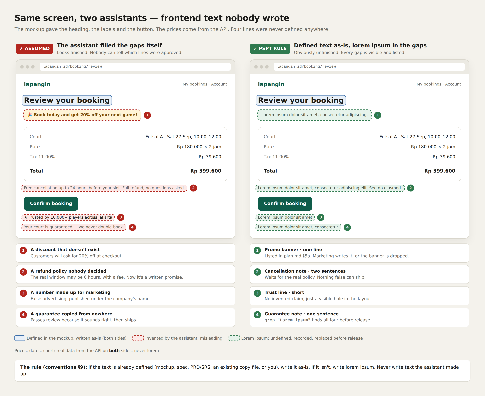

# pspt

A Claude Code plugin for spec-driven development.

You write the requirements and draw the screens. `pspt` derives the engineering
specification set from them — data model, architecture, endpoint contracts, error
registry, testing strategy, phased plan — then drives the build loop against it.

```
brd.md · prd.md · srs.md · mockup/*.html      →      the whole engineering doc set
```

---

## Why

Hand an assistant a vague request and it invents a data model. Hand it the whole
repository and the answer is accurate, expensive, and drifts toward describing
the past instead of the target.

Hand it **one screen plus one specification file** and the answer is specific,
bounded, and directly reviewable against the screen.

That is the whole argument. A screen is the only honest statement of what data a
product actually needs — reading a summary card tells you a transaction carries a
unit price, a duration, a subtotal, a tax amount and a total. That one card
produces five columns, a constraint and a rounding rule. Starting from an
imagined ERD produces tables nobody renders.

## Install

```
/plugin marketplace add meQlause/pspt
/plugin install pspt@pspt
```

## Use

```
/pspt:status      where the project stands, what runs next
/pspt:spec        derive the next stage of the specification set
/pspt:enhance     grow the spec conversationally without breaking any existing requirement
/pspt:build       take one phase exit criterion through red → green → clean → check
/pspt:build-long  run /pspt:build in a loop until the user says stop
/pspt:trace       walk requirement → screen → column → endpoint → test
/pspt:code        add an error code everywhere it must appear, at once
/pspt:reg         reserve a numbered regression and wire its id into the specs
/pspt:ticket      talk a change through against the code, plan it test-first, build it in phases
/pspt:ticket-build  execute every approved ticket not yet built, one ticket at a time
```

`/pspt:enhance` changes the spec; `/pspt:ticket` turns one request into a
planned, approved piece of work; `/pspt:build` implements one exit criterion.
Three skills, three jobs, no overlap.

`/pspt:ticket <name> <request>` starts as a conversation, like enhance: it asks
one or two questions at a time and reads the code as it goes, so every question
is settled — by you or by the code — before anything is written. When you say
ready, it writes `tickets/<slug>/` — `request.md`
(scope and checkable acceptance criteria), `plan.md` (the code as it is, every
affected and at-risk file, and the test cases written before any code) and
`phase.md` (additive first, then the minimal wire-in, then docs). It stops for
your approval before touching code, then builds phase by phase, recording every
test result, and stops again the moment a file outside the plan needs to change.

After approval you choose: build it now, or queue it. `/pspt:ticket-build` runs
the queue — any ticket left in progress first, then approved tickets oldest
first — re-checking each plan against the current code before building it, one
ticket to close-out before the next starts. It stops on a stale plan, a red
test or an unplanned file rather than skipping ahead.

`/pspt:ticket` reads code through [jCodeMunch](https://pypi.org/project/jcodemunch-mcp/)
(an MCP code index). If it is missing, the skill asks before installing it
(`uv tool install jcodemunch-mcp`, `claude mcp add`) and adds its one-line policy
to your `CLAUDE.md`; decline and the ticket does not start. jCodeMunch is free
for non-commercial use; commercial use needs its own licence.

## What it requires

Four inputs, and it refuses without them:

| | |
|---|---|
| `brd.md` | why this is being built — objectives, stakeholders, success metrics |
| `prd.md` | what the product does — users, features, flows, scope |
| `srs.md` | what must be true — numbered requirements, functional and non-functional |
| `mockup/` | static HTML, CSS and vanilla JS, with **every state drawn** |

Found by content, not by filename, so your naming is your own.

It also blocks if the requirements and the mockup disagree — a functional
requirement no screen realises, or a screen state no requirement covers. Each gap
is a missing screen, an out-of-scope requirement, or an undocumented feature, and
all three are cheap to fix now and expensive to fix after six tables and ten
endpoints exist.

So it either produces a complete, traceable document set, or it produces a list
of what disagrees. Never a half-spec.

## What it produces

```
<parent repo>/
  docs/
    strict-rules.md   data-spec.md   error-handling.md   phases.md      shared
    BE/  be-architecture.md  be-stack.md  testing.md  features/*.md
    FE/  fe-architecture.md  fe-stack.md  design-system.md  fidelity.md  ui-gaps.md  features/*.md
  tickets/<slug>/  request.md  plan.md  phase.md               /pspt:ticket
  .gitmodules
  backend/     → <owner>/<slug>-backend   (git submodule)
  frontend/    → <owner>/<slug>-frontend  (git submodule)
```

One stage per invocation, stopping at each checkpoint. Nothing moves right until
the artifact on the left has been read.

`backend/` and `frontend/` are **git submodules**, each with its own GitHub
repository. The parent repo tracks the specification, the mockup, and the two
pinned submodule commits. The first `/pspt:build` invocation creates the two
remotes via `gh repo create --private` and wires the submodules; every later
invocation writes into whichever submodule the exit criterion belongs to and
commits — inside the submodule, then in the parent so the pointer moves in the
same change. No push; the user pushes on their own cadence.

Requires `gh` (GitHub CLI) installed and authenticated. See SR-3.

| Stage | Produces |
|---|---|
| S2 | Extraction table, ERD, relationships with delete **and** update rules, the constraints that carry a guarantee |
| S3 | Strict rules, error registry, architecture and stack per side |
| S4 | Endpoint contracts, server-owned fields, error tables, testing strategy, reserved regressions |
| S5 | Design tokens, refactor map, screen specs with acceptance criteria |
| S6 | Two tracks, dependencies, sizes, checkbox exit criteria |
| S7 | Mockup fidelity: a script analyses the mockup into text roles, components and variants, each defined once; the app is held to it — every screen, state and width pixel-compared, fonts and spacing exactly equal per component, every asset hash-equal, every interaction working for real |
| S8 | UI gap analysis: every loading, empty, error, confirmation, toast, offline and not-found state the spec requires but the mockup never drew — found from the spec, grouped into patterns, recommended from existing components, asked last, and drawn into the mockup |

## Fixed, never asked

TypeScript. Feature-based architecture. vitest, Playwright with Chromium, eslint,
prettier, knip, husky, commitlint. And a **pure decision layer** — `*.rules.ts`
files the linter forbids from importing an ORM or a framework, or from touching
`Date`, `fetch` or `Math.random`.

That last one is what makes "every service testable with fakes, no container, no
database, no clock drift" mechanical instead of aspirational. The service
resolves the clock and passes the instant *in*; the rule is a pure function of
its arguments, so every branch is reachable from a test with no fixtures at all.

## Asked per project

Database · backend framework · ORM · DI container · frontend framework · routing
· server state · validation.

Asked in dependency order, and an answer deletes later questions — pick NestJS
and you are not asked about a DI container; pick Next.js and you are not asked
about routing. Each presented as candidates with the trade-off and the trap,
never as an open question.

If the database is not PostgreSQL it says so rather than emitting
`EXCLUDE USING gist` that will not run, and proposes the real alternative.

## Frontend copy

If the text is already defined — mockup, spec, PRD/SRS, an existing copy file,
or you — it is written as-is. If it is not, it is lorem ipsum, recorded so it is
replaced before release. For each placeholder the assistant writes a proposed
replacement in `docs/FE/copy-recommendations.md` (`COPY-nnn`, referenced from
the code); it replaces the lorem ipsum only after you approve it. The assistant
never puts copy it was not given on a screen.
[`references/frontend-copy.md`](references/frontend-copy.md) shows why, side by
side:



## Lint rules

`references/lint/<stack>.md` explains the rules for each supported framework —
Express, NestJS, Next.js, React: why each threshold, and what it forces into the
spec.

`references/toolchain/` **is** the toolchain, as files: per stack a complete,
verified `eslint.config.mjs` and `knip.json`, shared Prettier, commitlint
(with SR-6 as a rule) and husky hooks, pinned `devDependencies`, and the one
`check` script — format, lint, types, knip. `/pspt:build` copies them into each
submodule **byte for byte** and, on every invocation — as do `build-long`,
`ticket` and `ticket-build` — checks them against `toolchain/manifest.json`:
every file's sha256, no second config, exact versions, hooks active,
TypeScript strict. Any difference is drift: reported, never silently "fixed" in
either direction. The plugin never authors a tool config in your project, so
there is one source and nothing to drift. `toolchain/verify/` proves each
ESLint config fires every rule; see
[`references/toolchain/README.md`](references/toolchain/README.md).

Three of those rules change what a generated document may say:

- `complexity: 8` means field rules are specified as **schema**, never as service branching
- `no-nested-conditional` means code-to-behaviour mappings are specified as a **`const` lookup table**
- `todo-tag` means deferred work lives in `phases.md` — never as a comment

And `warn` is not advisory: the commit hook runs `--max-warnings=0`.

## Changelog

What changed in every version, with a picture of each:
[`CHANGELOG.md`](CHANGELOG.md). Each release is a git tag, `v0.1.0` to `v0.6.0`, published on the Releases page.

## Credit

Implements the *Rapid Development with SDD + TDD* method. The worked example the
templates are shaped from is a court-booking system in Jakarta: two screens,
roughly 600 lines of static HTML, which produced six tables, one exclusion
constraint, twelve error codes, ten endpoints and eleven phases.

## Licence

MIT
