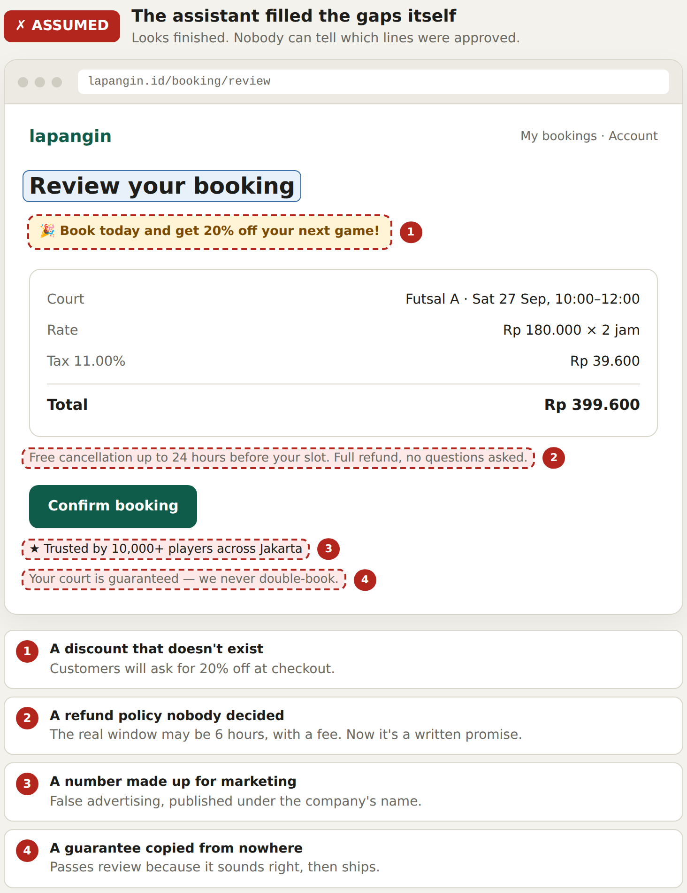
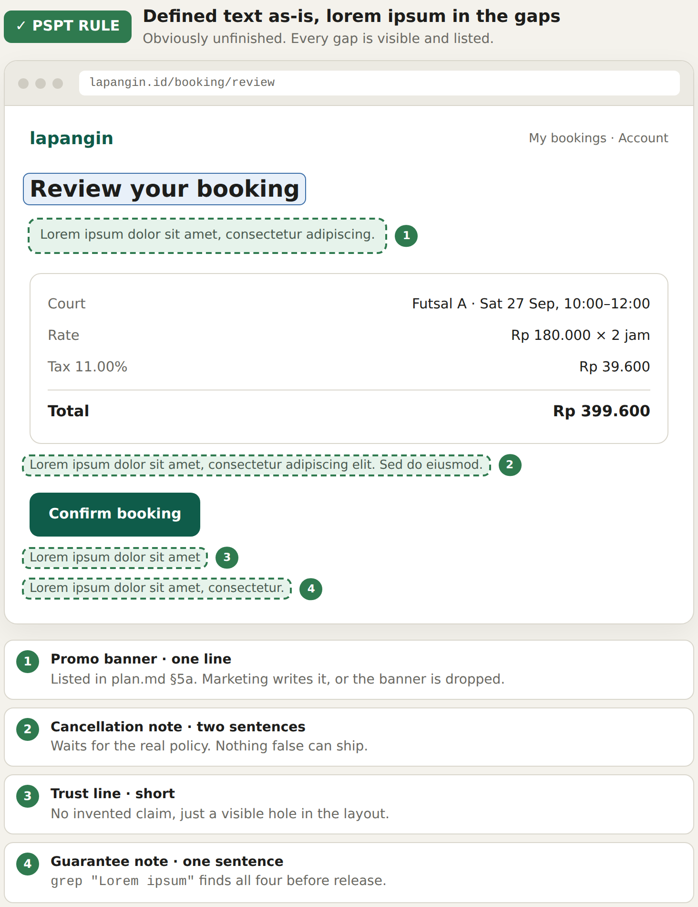
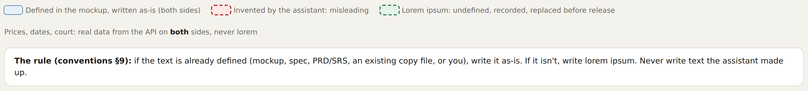

# Frontend copy — recommendation for AI assistants

**Applies to:** every frontend file an assistant writes · **Rule:** [`conventions.md` §9](./conventions.md#9-frontend-copy--never-invent-text) · **Used by:** `/pspt:spec` S5, `/pspt:build`, `/pspt:ticket`, `/pspt:ticket-build`

This is the recommendation behind conventions §9, shown on one screen. It
explains **why** an assistant must never write frontend text it was not given,
and what to write instead. The rule itself lives in conventions §9; this file
does not restate it differently, it shows it.


---

## 1. The situation

**See:** the whole image above — both panels start from the same inputs.

The mockup defined the heading **Review your booking**, the row labels and the
**Confirm booking** button. The API supplies the court, the date and every
amount. Four lines on the screen were **never defined** anywhere — not in the
mockup, not in the spec, not in the PRD/SRS, not by the user.

What the assistant writes into those four lines is the whole difference between
the two panels.

| Kind of text on this screen | Where it came from | Both panels |
|---|---|---|
| Heading, labels, button | The mockup | Written as-is |
| Court, date, rate, tax, total | The API | Real values — never lorem |
| Four other lines | **Nowhere** | ← the difference |

## 2. Assumed — the assistant fills the gaps itself

**See:** the left panel, markers ① to ④.



The page looks finished — and that is the problem. Nobody reviewing it can tell
which lines were approved and which were made up, so the made-up ones ship.

| # | Invented text | Why it misleads |
|---|---|---|
| ① | "Book today and get 20% off your next game!" | A discount that does not exist. Customers will ask for it at checkout |
| ② | "Free cancellation up to 24 hours… full refund" | A refund policy nobody decided. The real window may be 6 hours with a fee — now it is a written promise |
| ③ | "Trusted by 10,000+ players across Jakarta" | A number made up for marketing — false advertising under the company's name |
| ④ | "Your court is guaranteed — we never double-book" | A guarantee nobody approved. It sounds right, so it passes review |

> Invented copy is the most dangerous kind of placeholder, because it does not
> look like one. Each line above is a business decision taken by an assistant.

**Recommendation:** never do this. Not for a demo, not "just for now", not
because the sentence seems obvious.

## 3. The pspt rule — defined text as-is, lorem ipsum in the gaps

**See:** the right panel, markers ① to ④.



The same four spots hold lorem ipsum, each sized to the length the layout
expects. The page is obviously unfinished, so nothing false can reach a
customer.

| # | Spot | Placeholder | What happens next |
|---|---|---|---|
| ① | Promo banner · one line | `Lorem ipsum dolor sit amet, consectetur adipiscing.` | Listed in `plan.md` §5a. Marketing writes it, or the banner is dropped |
| ② | Cancellation note · two sentences | `Lorem ipsum dolor sit amet, consectetur adipiscing elit. Sed do eiusmod.` | Waits for the real policy |
| ③ | Trust line · short | `Lorem ipsum dolor sit amet` | No claim until someone can back it |
| ④ | Guarantee note · one sentence | `Lorem ipsum dolor sit amet, consectetur.` | Replaced by the approved sentence, or removed |

**Recommendation:**

1. **Look for the text first.** Mockup markup, then the spec
   (`error-handling.md` §4, the screen document), then the PRD/SRS, then an
   existing copy constant in the codebase, then the user. If any of them has it,
   write it verbatim and do not ask again.
2. **Only if none has it, write lorem ipsum** — sized to the expected length,
   nothing half-invented, no `TBD`, no `Text here`.
3. **Keep it in the feature's copy constant**, never inline, so
   `grep -rn "Lorem ipsum"` finds every one.
4. **Record it** — a row in the screen document, or in the ticket's `plan.md`
   §5a — so replacing them is a list.
5. **Recommend the replacement** in `docs/FE/copy-recommendations.md`, one
   `COPY-nnn` section per placeholder, with a comment in the copy constant
   pointing at it. The user approves, then it replaces the lorem ipsum — see §6.
6. **Never assert it in a test.** Find the element by role or test id.

## 4. Reading the image

**See:** the key under the two panels.



| Marking | Means | Allowed? |
|---|---|---|
| Blue outline | Defined in the mockup or spec, written as-is | Yes — on both sides |
| Red dashed | Invented by the assistant | **Never** |
| Green dashed | Lorem ipsum for text nothing defines, recorded | Yes — replaced before release |
| No marking (prices, dates, court) | Real data from the API | Yes — never lorem, on both sides |

## 5. What this does not cover

**See:** the court, date and amount rows — identical in both panels.

Data is not copy. Names, prices, dates and references come from the API, and
fixtures and examples use realistic values per
[`house-style.md`](./house-style.md). `Rp 399.600` is never lorem ipsum. The
rule is only about **written** text a person is supposed to author.

## 6. Recommending the replacement

**See:** the right panel, markers ① to ④ — each one gets a section below.

Lorem ipsum is what the code carries. What the assistant *proposes* goes in
`docs/FE/copy-recommendations.md`, one section per marker, and the copy constant
points at it:

```ts
// review.copy.ts
export const REVIEW_COPY = {
  // COPY-001 · docs/FE/copy-recommendations.md#copy-001
  PROMO_BANNER: 'Lorem ipsum dolor sit amet, consectetur adipiscing.',
  // COPY-002 · docs/FE/copy-recommendations.md#copy-002
  CANCEL_NOTE: 'Lorem ipsum dolor sit amet, consectetur adipiscing elit. Sed do eiusmod.',
  // COPY-003 · docs/FE/copy-recommendations.md#copy-003
  TRUST_LINE: 'Lorem ipsum dolor sit amet',
  // COPY-004 · docs/FE/copy-recommendations.md#copy-004
  GUARANTEE_NOTE: 'Lorem ipsum dolor sit amet, consectetur.',
} as const;
```

Compare each recommendation with the invented line from the left panel: the
recommendation says only what a source says, and every missing fact is listed
instead of made up. The full template and the status rules are conventions
§9.1.

### COPY-001 — marker ① · promo banner

**Status:** proposed · **AI recommendation — not approved** · **Length:** one line

| Option | Text |
|---|---|
| **A — recommended** | *Remove the banner.* |
| B | Check the details below before you confirm. |

**Why A:** no source defines any promotion. A banner with nothing true to say
should not exist; B keeps the space with a neutral, fact-free line.
**Facts to confirm:** is there a promotion at all? If yes, its exact terms.
**Invented instead (left ①):** "Book today and get 20% off your next game!"

### COPY-002 — marker ② · cancellation note

**Status:** proposed · **AI recommendation — not approved** · **Length:** two sentences

| Option | Text |
|---|---|
| **A — recommended** | You can cancel up to {cancellationWindowHours} hours before your slot starts. After that, the booking can no longer be changed. |
| B | Need to cancel? Do it at least {cancellationWindowHours} hours before your slot. |

**Based on:** the cancellation window rule (FR), value from configuration.
**Facts to confirm:** whether a refund is given, and how much.
**Invented instead (left ②):** "Free cancellation up to 24 hours before your slot. Full refund, no questions asked."

### COPY-003 — marker ③ · trust line

**Status:** proposed · **AI recommendation — not approved** · **Length:** short

| Option | Text |
|---|---|
| **A — recommended** | *Remove the line.* |
| B | {bookingCount} bookings made on lapangin — *only if the figure is served by the API* |

**Why A:** social proof needs a real figure; none exists in any source.
**Facts to confirm:** a real, current figure and where it comes from.
**Invented instead (left ③):** "★ Trusted by 10,000+ players across Jakarta"

### COPY-004 — marker ④ · guarantee note

**Status:** proposed · **AI recommendation — not approved** · **Length:** one sentence

| Option | Text |
|---|---|
| **A — recommended** | Once you confirm, this slot is held for you. |
| B | *Remove the line.* |

**Based on:** the non-overlap constraint in `data-spec.md` §6 — the slot cannot be booked twice once confirmed.
**Facts to confirm:** whether "held" covers the payment window, or only after payment.
**Invented instead (left ④):** "Your court is guaranteed — we never double-book."

---

All four images are rendered from one source,
[`images/frontend-copy-compare.html`](./images/frontend-copy-compare.html) — the
full page, then the `#left`, `#right` and `#key` elements, at 1600 px wide and
2× scale — so the panels always match. If the rule in conventions §9 changes,
edit that file, re-render the images and update this document in the same
commit.
